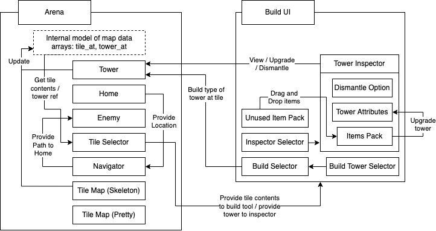
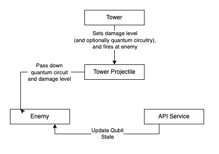

# Milestone 1 README

## Motivation:

From Google’s claim of already achieving quantum supremacy to IBM’s Qiskit offering to one day give companies API access to their own quantum computing runtimes, there is a lot of exciting news and headlines that still seems almost mystical. However, a lot of the material online is either difficult to digest and not for those without a physics background or they are fluffy pop science articles. We want to take the time to really understand how this works, and try our hand at some quantum computing concepts.

## Aim
Our aim is to make a game that both explains quantum principles, is fun to play, and gets us (as developers) familiar with game development and quantum computing.

## Core features

Defend the base against waves of attacks by enemies with turrets, gates, borders and strategy. This tower defence game will have enemies, defences and structures in superposition or in their measured state. The enemies and items can be in one of 2 states, visually coded as red or blue. When they spawn, they appear in superposition until their state is measured, which happens when they take damage. These basic tower defence functionality is the first set of core feature, and this part is functionally similar to coding for multiple types of damages / enemies in our tower defence game (imagine a tower defence game with elements)

Towers need to be upgradeable, and can potentially be imbued with quantum logic to impact enemies without collapsing the superposition. This is our second set of core feature, to write quantum circuitry and deploy it on our upgraded towers to impact enemies and move them from one state of superposition to another. This moves it well beyond the realm of traditional tower defence game and requires Qiskit integration.

Some of the structures and game mechanics will be simplifications of techniques used in real life quantum computing, such as entanglement and quantum state manipulation (e.g. with Hadamard gates). Over the course of the gameplay, gamers should be able to learn these concepts and be more comfortable with them, even if they do not understand quantum mechanics. This may involve additional educational info in pop ups.

# Project Log

| Start Date  | End Date    | Member    | Task                                      | Comments                                        | Hours |
| :--------:  | :--------:  | :------:  | :---------------------------------------- | :-----------------------------------------------| :---: |
| 2021-05-01  | 2021-05-10  | Tee Chin  | Learning godot and game design principles | Made a Pong clone                               | 12    |
| 2021-05-10  | 2021-05-14  | Tee Chin  | Make Basic TD Mechanics                   | Turrets Timers Homing Projectiles               | 4     |
| 2021-05-01  | 2021-05-10  | Bharath   | Learning godot and game design principles | Made a Pong clone                               | 12    |
| 2021-05-10  | 2021-05-14  | Bharath   | Make Basic TD Mechanics                   | TileMap Home and Enemy behaviour and state      | 4     |
| 2021-05-14  | 2021-05-15  | Bharath   | Make Basic TD Mechanics                   | Enemy Spawning and Spawn Points                 | 3     |
| 2021-05-14  | 2021-05-16  | Bharath   | Make Basic TD Mechanics                   | Physics Layer and enemy path testing            | 7     |
| 2021-05-17  | 2021-05-17  | Bharath   | Team meeting                              | Discussing how to integrate or split            | 2     |
| 2021-05-18  | 2021-05-19  | Bharath   | Managing new assets and reorganising work | Bulk of time on learning dev practices          | 3     |
| 2021-05-19  | 2021-05-22  | Bharath   | Enemy collision (Attempt 1)               | Rolled back commits entirely, unusable here     | 4     |
| 2021-05-19  | 2021-05-22  | Bharath   | Enemy collision and pathfinding mechanics | Bulk on time on learning godot physics          | 6     |
| 2021-05-23  | 2021-05-29  | Bharath   | Tile Selector (UI for Maps)               | Detecting tile content & displaying overlay     | 4     |
| 2021-05-23  | 2021-05-29  | Bharath   | Working on PR and Merges and cleaning up  | And integrating tee chin UI work to main        | 1     |
| 2021-05-29  | 2021-05-30  | Bharath   | Create new tile map (lava world)          | Some code logic, mostly design work             | 4     |
| 2021-05-29  | 2021-05-30  | Bharath   | Make basic API on localhost               | Build basic Express app to return 0 or 1        | 3     |
| 2021-05-29  | 2021-05-30  | Bharath   | Deploy API on heroku                      | Use Heroku documentation                        | 2     |
| 2021-05-29  | 2021-05-30  | Bharath   | Connecting Enemy to the API               | On taking damage, choose red / blue             | 2     |
| 2021-05-29  | 2021-05-30  | Bharath   | Personal Milestone 1 Tasks                | Meeting, Documentation, Exporting               | 3     |
| 2021-05-31  | 2021-05-31  | Bharath   | Milestone 1 Team Meeting and Submission   | Submission Documents                            | 2     |
| 2021-05-31  | 2021-05-31  | Tee Chin  | Milestone 1 Team Meeting and Submission   | Submission Documents                            | 2     |

| Member    | Hours |
| :------:  | :---: |
| Bharath   |  62   |
| Tee Chin  |       |

# Program Flow

## Overview of Game Source Code

Programming in our code is largely split into 2:
- Arena: in charge of dealing with all the tiles, enemy, home base and towers
- Build Tool UI: takes in user interaction to build / upgrade / destroy and passes it on to the Arena to execute

The Arena itself has multiple important nodes, but here are some clarifications on the most inscrutable parts:

**Navigation**

- When requested by an enemy instance, plots a valid path across navigable tiles (see Skeleton Tile Map)
- Is not aware of other future enemy positions when calculating for a particular enemy, so it cannot plot around non tile obstacles. Depends on enemy to manage collisions itself.

**Tower & Enemy & Home**

- Enemies will ask navigator for map and proceed along the route, barring any collisions. For every collision it will stagger randomly for a predetermined period of time and then request a new path.
- As enemies enter / leave tower range, the tower will add to memory / forget these instances. Towers will continuously fire at the nearest enemy in memory.
- Enemies and home have specific behaviour and animation for different behaviours to show satisfying feedback and for game mechanics (taking damage takes priority over all other behaviour, attacks require a brief cool down, etc)

**Internal Representation**

- `tower_at` - an array of Tower [WeakRefs](https://docs.godotengine.org/en/stable/classes/class_weakref.html) for use when upgrading / building / dismantling towers and used when Arena is updated by / updates Build Tool UI
- `tile_at` - an array of enum values representing the content of the tile

**TileSelector**

- Square that flashes Green / Red based on if the tile is a valid position for user action (based on whether they are in build mode)
- follows user interaction and is continually updated by `tower_at` and `tile_at`.
- On the user taking action, the TileSelector provides the BuildTool the tile location or the tower if applicable for further action (building / dismantling / inspection / upgrade by user)

**Tile Map**

- Tile Map (Pretty): 32x32 and 16x16 tiled pixel art to show a nice user friendly depiction. Does not have any responsibility other than display
- Tile Map (Skeleton): 64x64 bare tiles that provides an easy way for level designer to communicate the position of paths to the map's internal representation

**Build Tool**

- Primarily contains build and inspect buttons that set user mode.
- In build mode, shows an otherwise hidden list of tower buttons to set type of tower to be built
- (Disabled in v0.7-alpha release) In inspect mode, selecting a tower will show a tower inspector window that displays attributes and items as well as provide upgrade and dismantle options
- (Disabled in v0.7-alpha release) Contains an item pack that can be consumed by towers to upgrade their attributes

A diagram summarising these interactions can be seen below:

## Overview of Enemy Quantum Logic

In quantum computing, qubits replace the traditional 0s or 1s of bits in classical computing.
Where a bit can only be 0 or 1, qubits appear to be in a coherent superposition (in _both_ states of 0 and 1 simultaneously).
Qubits will however collapse to just holding 1 bit of information (turn into a typical bit in either 0 or 1 state) when measured.
Our enemies can be either blue or red, but their state is represented as a qubit.

As such, quantum powered (tensor) weapons or classical (quodite) weapons can be employed against them:
- Tensor: change change the state of their qubit without measurement (applying qubits through the quantum logic circuits in the weapons, changing their probabilities in the red and blue dimensions) 
- Quodite: can be dealt direct typical damage, which would also measure them (collapsing them to red or blue dimensions)

Quodite and Tensor effects can be combined, resulting in many unique possibilities for our game users to experiment with quantum computing.
Currently in the milestone 1 submission, all that is being explored is collapsing an enemy that initially is in a superposition of blue and red states.
Upon first contact with a classical tower projectile each of these enemies will collapse to be only in either blue or red dimension.

In the future, specialised quantum missiles (Tensor in our game lore), will be able to apply quantum computation on the enemies in superposition.
This requires quite specialised programming which Godot may not be able to fill, so we are employing an API service.
The current version used in v0.7-alpha is extremely barebones — it shows the result of collapsing a qubit into either 0 or 1: [Measuring a superposition (Reload multiple times)](https://tower-defence-qiskit-api.herokuapp.com/test-enemy-gen)). 

This flow from an enemy getting hit with a projectile to checking the API and updating its internal data can be seen as below:

# Video Link

[https://bit.ly/3hvXUXV](https://bit.ly/3hvXUXV)

# Poster Link

[https://raw.githubusercontent.com/bharathcs/quantum-defence/main/docs/milestone-1/poster.png](https://raw.githubusercontent.com/bharathcs/quantum-defence/main/docs/milestone-1/poster.png)
