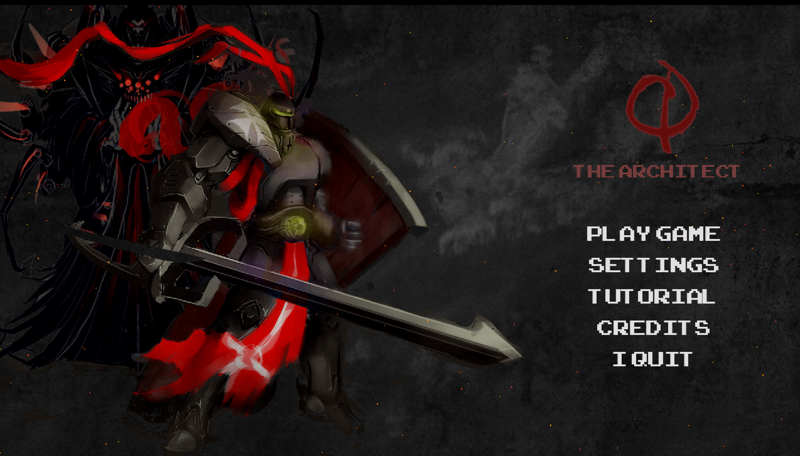

# User Guide

## Installation

1. Navigate to [Quantum-Defence releases](https://github.com/bharathcs/quantum-defence/releases) and download the release for your platform.
1. Unpack it with your inbuilt utilities and run the main app.

- If you encounter any issues regarding 'unidentified developer' or 'unsigned certificate' and you are on a MacOS - follow this [link](https://support.apple.com/en-sg/guide/mac-help/mh40616/mac)

## User Stories

### Menu

### Tutorial

Currently this is very light and not ready at all for milestone 2.

Eventually, it will guide the user through the following concepts:

1. ## Tower Defence Mechanics
