# Getting Started

1. Download godot. Godot is an open source game development engine that can be downloaded [here](https://https://godotengine.org/download/windows).
1. Clone the repo into your local folder by using the following command:

```shell
git clone https://github.com/bharathcs/quantum-defence.git
```

1. Open the godot game engine and select the clone repo to import. Edit as you please. All tscn files are automatically updated by godot when you change the scenes. Godot is the only dependancy and you should be able to run everything.

## Contributing

If you would like to help [report bugs](https://github.com/bharathcs/quantum-defence/issues) or [write code](https://github.com/bharathcs/quantum-defence/pulls) for this project, you can reach out to us through these links. We don't have any formal submission guidelines (just be civil please) and we welcome any input.

# Program Flow

## Overview of Game Source Code


The entire game itself has multiple important nodes, but here are some clarifications on the most inscrutable parts below:

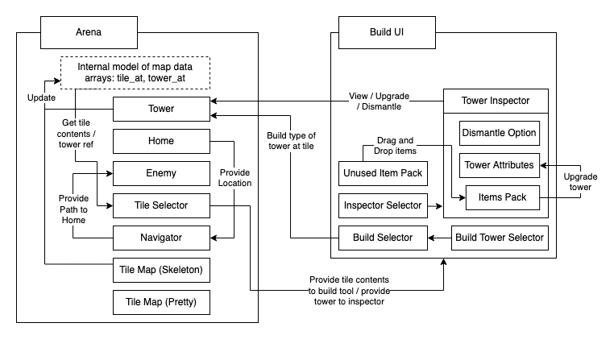


### Arena

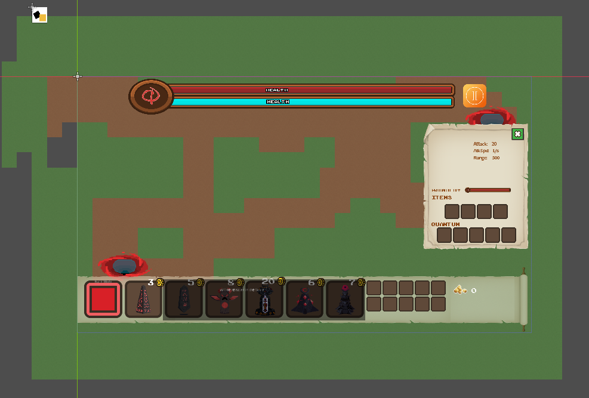 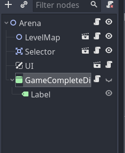

- The arena is a node2d that contains the level map, level selector and the UI.
- Arena also has the build_tower function which stores a tower's information(position etc.) when they are built.
- The arena is the scene that the player sees when he/she enters the game. Any change of map(different levels) would simply be a change of level selector, with the arena still being the main scene.

**Internal Representation**

- `tower_at` - an array of Tower [WeakRefs](https://docs.godotengine.org/en/stable/classes/class_weakref.html) for use when upgrading / building / dismantling towers and used when Arena is updated by / updates Build Tool UI
- `tile_at` - an array of enum values representing the content of the tile


### Level Map

 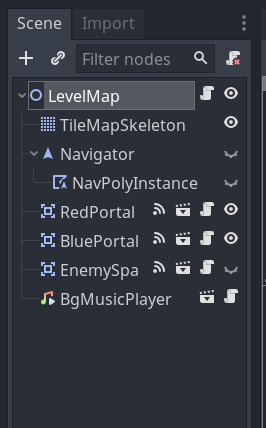

The level map is a node2d scene that contains the tile map skeleton and tile map pretty, the navigator, the portals, the enemy spawn point and the background music player.
Each level in the game is a scene that inherits from level map.

**Tile map pretty and tile map skeleton**

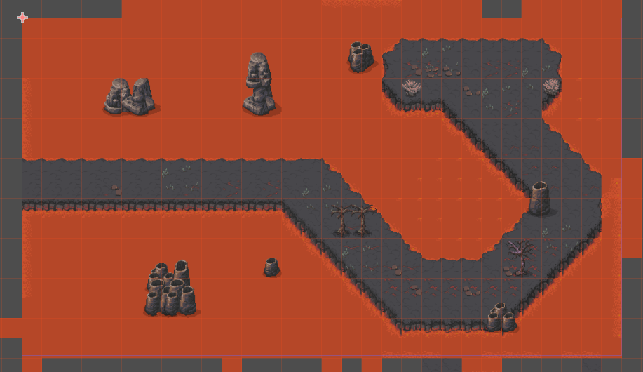 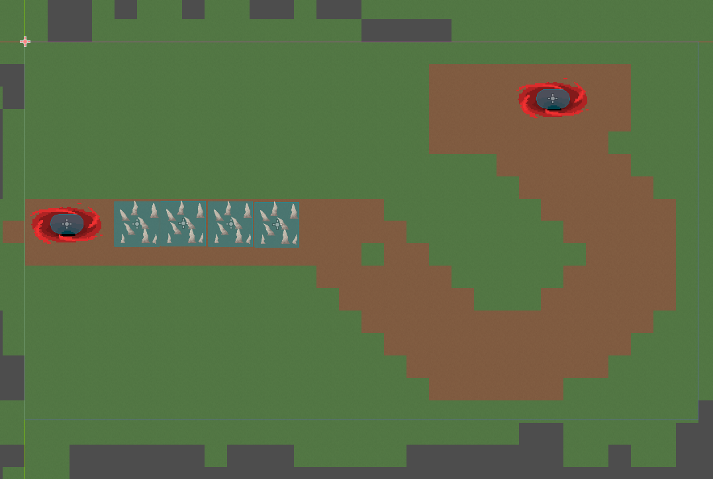

- Tile Map (Pretty): 32x32 and 16x16 tiled pixel art to show a nice user friendly depiction. Does not have any responsibility other than display
- Tile Map (Skeleton): 64x64 bare tiles that provides an easy way for level designer to communicate the position of paths to the map's internal representation
- Each level in the game(E.g tutorial or level one) all extends from level map and have an additional tilemap pretty instance. This tile map pretty instance gives the illusion of a different map.
- The tile map skeleton is then updated to indicate the valid tiles in the map.


**Navigation**

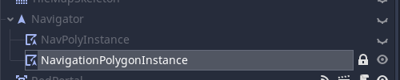
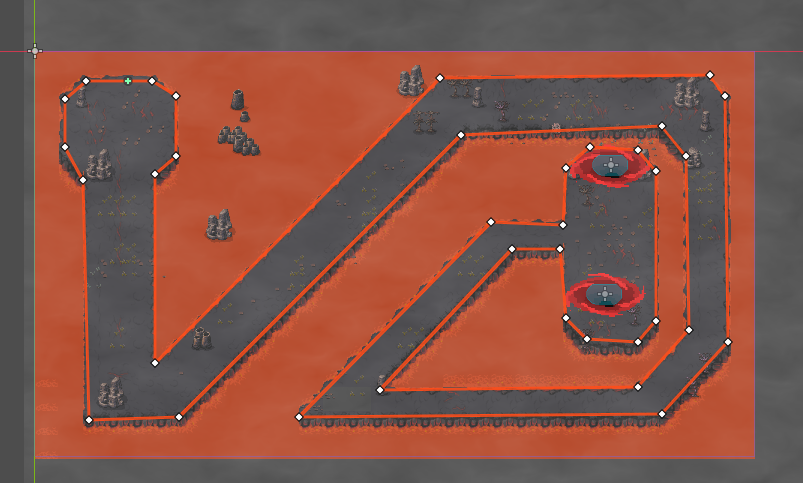

- Navigation is an inbuilt godot node that helps in navigation. To change the path of the enemies, edit 
NavigatorPolygon in navigator.

- When requested by an enemy instance, plots a valid path across navigable tiles (see Skeleton Tile Map)
- Is not aware f other future enemy positions when calculating for a particular enemy, so it cannot plot around non tile obstacles. Depends on enemy to manage collisions itself.
- Like the tile map skeleton, navigation is different for different maps.

**Enemy**

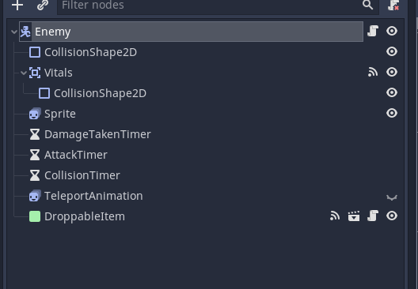
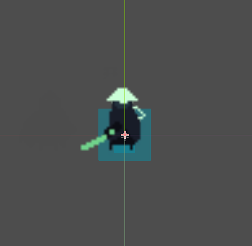

- Enemies will ask navigator for map and proceed along the route, barring any collisions. For every collision it will stagger randomly for a predetermined period of time and then request a new path.
- As enemies enter / leave tower range, the tower will add to memory / forget these instances. Towers will continuously fire at the nearest enemy in memory.
- Enemies and home have specific behaviour and animation for different behaviours to show satisfying feedback and for game mechanics (taking damage takes priority over all other behaviour, attacks require a brief cool down, etc)
- Enemies also have the items before they are dropped. When killed, they drop gold which immediately added to the buildUI. Hence the buildUi's add gold function is called here. They also have a chance to drop items that can be clicked to be added to the buildUI.

**Home**

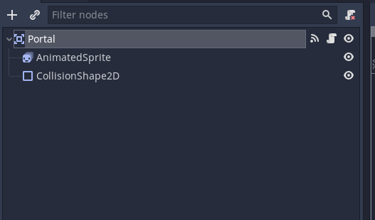
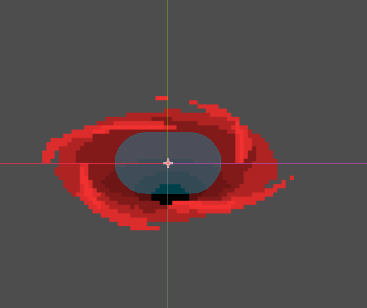

- The portal node is an area2d node that detects when an enemy enters the portal. When an enemy enters, it emits 
a signal that changes the health of the health bar as well as the portal.


### UI

**UI**

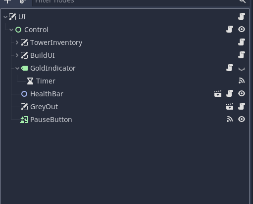
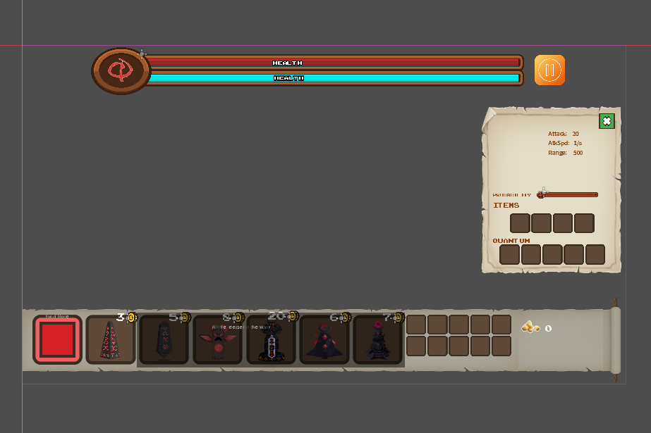

- The UI is a canvas_material that contains the tower inventory, buildUI and some other functionality which will
be elaborated. To allow for interactions between the buildUI and the towerInventory, the scenes were merged and
thus any changes that the developer wants to implement to either the buildUI or the towerInventory has to be done
through this instead. 

- Refer to the above for the functionality of both the buildUI and the towerInventory.

- Other main functionalities of the UI is the health bar. The health bar is a node2d that contains both the red
and blue bar. If either ones reaches zero, the game ends.


**Tower Inventory**

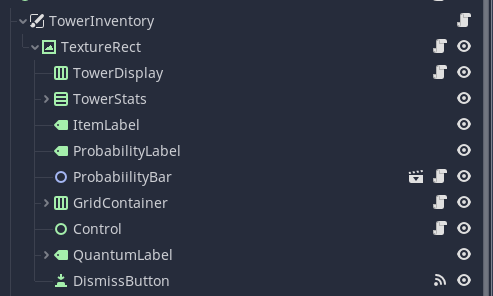
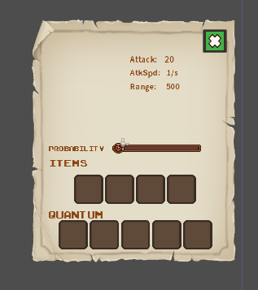

- The tower inventory is a canvas item material which contains many control nodes for organisation.
- There is only one instance of tower inventory and it is part of UI. Clicking on another tower and changing the
tower displayed in tower inventory is a mere swapping of sprites in the tower inventory. Tower inventory has a
main field known as tower_to_be_built. This is intended to align with the build_UI tower to be build. This tower
to be built is the tower inspected at the current moment. 

**Build UI**

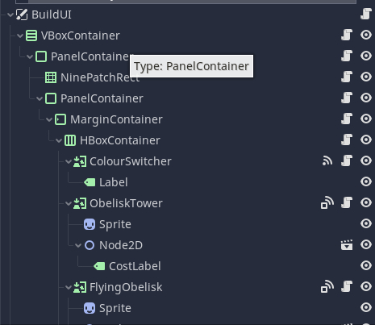
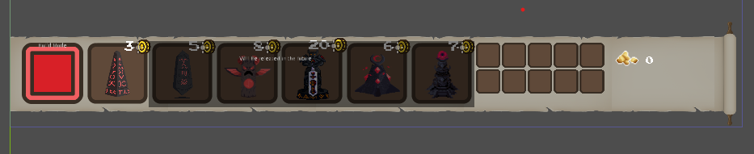

- Build UI is a canvas item node that encompasses the entire building process. Each button is connected to it which
connected to tile selector. When a tower of choice is pressed, the function of the button is called and sets
the action of the tile selector, which decides which tower will be built. The helper_mouse_tower function also 
adds a inactive tower(cannot fire) to the mouse. This allows players to see the tower placement before it is
actually built.


**Gold**

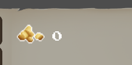

- Gold does not have its own scene but is simply under goldlabel in buildUI.
- The main logic of the gold is done in a goldLabel.gd. BuildUI's change_gold() and set_gold() functions all interact
with this. Calling reset() is to reset all the gold of the stage.


**Items**

- Items are split into normal items and droppable items.
- The normal items are normal node2d that contain a textureRect.
These normal items are the ones that contain the information
of the item and are dragged around from slot to slot.
The droppable items contain the normal items and are intended
for user input(when a player clicks them, it appears in the buildUI). Thus, a control node is required to detect
user input.


**Drag and Drop**

- Most of the drag and drop implementation is found three files. UI.gd which acts as a generic UI script that prevents 
any item from being dropped into an unwanted place. Any control node that has this script will not have an item
dissapear when dragged onto them. The other files would be both towerInventorySlot.gd and buildUISlot.gd. Both these scripts handle the main functionality of allowing an item to be dragged from the buildUI to the tower inventory.
QuantumCircuitSlot.gd is a script that extends TowerInventorySlot.gd and only applies to quantum slots in the
tower inventory. When an item is picked up, from either the tower inventory slot or the buildUI slot, a dictionary ois created with the starting information. These are grouped under the term "Origin" with some of the dictionary keys refering to the origin slots items and the origin slots name for reference to know where the item comes from. When dropped into another slot, the dictionary then creates more information, grouped under the term "Target". These store information such as the target slots name and item(if there is an item in the slot) and act accordingly.

**Prompts and Instructions**

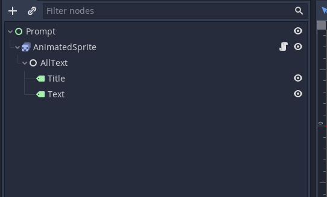
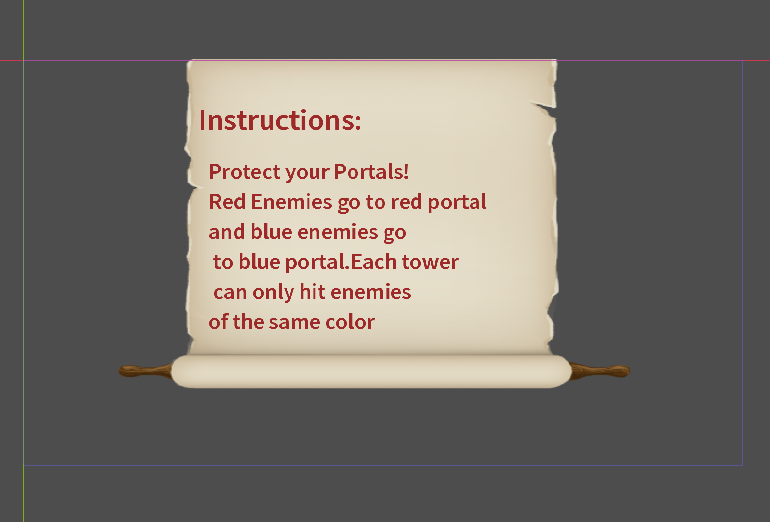

- The prompt is a standard control node that allows for interaction with the user. It also gives general
instructions to the user and the text can be toggle with when any button is pressed. The back button changes
the text to the previous text.

- These are handled by both the prompt scene (Prompt.tscn) and script(Prompt.gd) as well as the scoping nodes in UI.
The scoping nodes do no have their own scene and are simply part of UI. Thus any changing of information or scripts of scoping requires it to be done through UI.tscn. 


### TileSelector

**TileSelector**
- Square that flashes Green / Red based on if the tile is a valid position for user action (based on whether they are in build mode)
- follows user interaction and is continually updated by `tower_at` and `tile_at`.
- On the user taking action, the TileSelector provides the BuildTool the tile location or the tower if applicable for further action (building / dismantling / inspection / upgrade by user)
- When tile selector trying to build a tower over an invalid tile, a cancel icon shows up which indicates that a tower cannot be built there.

**Projectile**

- The projectile class is a kinematicBody2d node that has a collision shape and tile. Its intended effect is
to be shot by the tower and collide with the enemy. 

The projectile class have the contain the homing functionality and the inflict damage functionalioty

## Overview of Enemy Quantum Logic

In quantum computing, qubits replace the traditional 0s or 1s of bits in classical computing.
Where a bit can only be 0 or 1, qubits appear to be in a coherent superposition (in _both_ states of 0 and 1 simultaneously).
Qubits will however collapse to just holding 1 bit of information (turn into a typical bit in either 0 or 1 state) when measured.
Our enemies can be either blue or red, but their state is represented as a qubit.
For the sake of the game, the measurement of the qubits (which is the action that collapses them) is automatic.
This, firing at an enemy to put it into superposition will also immediately collapse them thereafter, turning them
either red or blue. 


The entire quantum library in this game is split into three
main files. A brief overview of the use of each node in will be shown here. For more information please
refer to 
[MicroQiskit gdscript](https://github.com/quantum-defence/MicroQiskit/blob/main/versions/Godot/dev-guide.md)

**QuantumCircuit**

- The file QuantumCircuit.gd handles the building of the circuit. This allows for building of all kinds of quantum
circuits by calling each each of the functions in succession to build the circuit of choice.


**Simulator.gd**

- Simulator is where the main logic of the quantum circuit is stored. It runs the quantum circuit and outputs the
probability based on the gates in the quantum circuit.

**QuantumNode**

- QuantumNode is a composition of both the simulator and the quantum circuit. Thus, devs should use this and reference both nodes when trying to work on anything quantum related.


