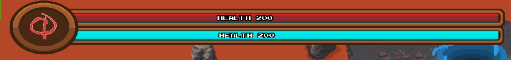
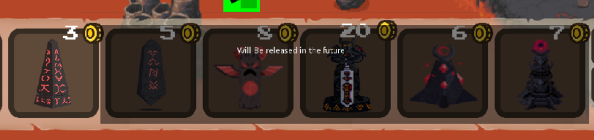
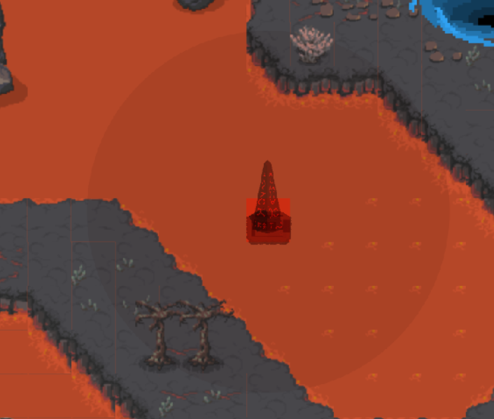
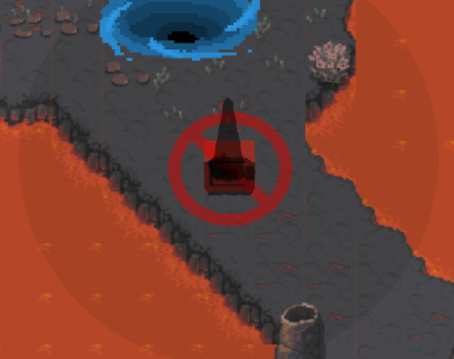
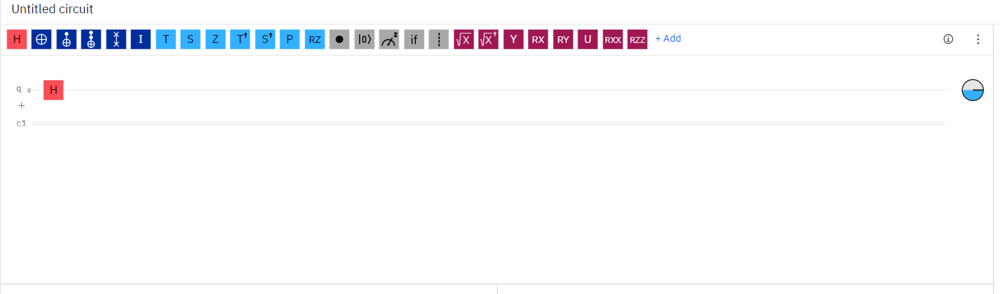
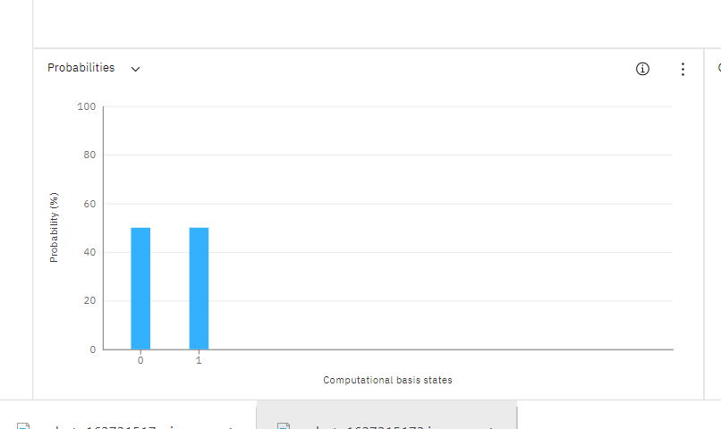
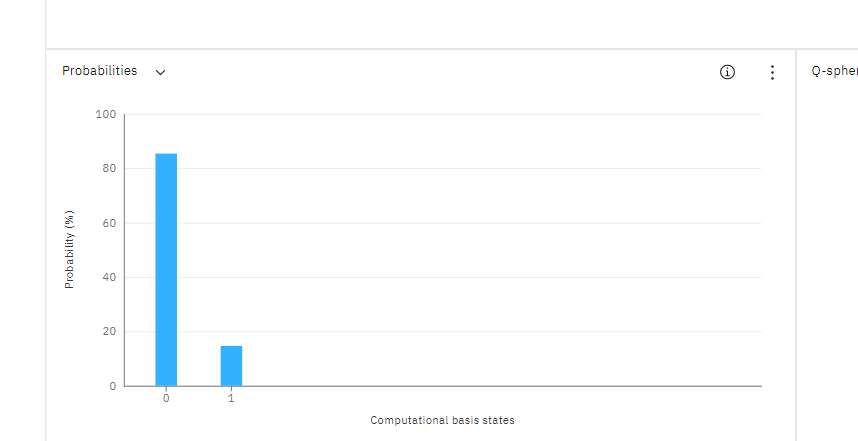
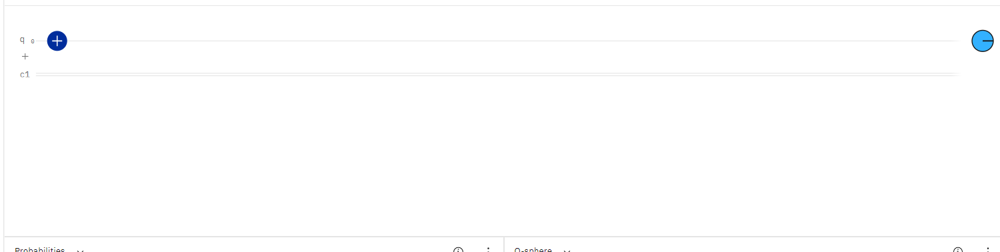
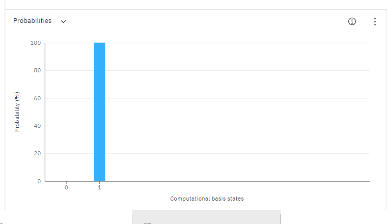

# User Guide

## Installation

1. Navigate to [Quantum-Defence releases](https://github.com/bharathcs/quantum-defence/releases) and download the release for your platform.
1. Unpack it with your inbuilt utilities and run the main app.

- If you encounter any issues regarding 'unidentified developer' or 'unsigned certificate' and you are on a MacOS - follow this [link](https://support.apple.com/en-sg/guide/mac-help/mh40616/mac)

## User Guide

### Menu

- Start a tutorial mode: The tutorial is structured to teach the basics of the game through a series of prompts.
Play the tutorial to familiarise yourself with the UI of the game. 
- Settings: Used to toggle the background music or sfx volume.
- Credits: Credits to everyone involved in the process of making the game.

### Arena Elements

- Enemies: Hostile actors that charge at their base (red / blue) to attack. Red enemies taget the red portal
and vice versa.
- Path: Navigable surface for the enemy. This is usually the stone tiles in the lava maps. 
Towers cannot be built in these paths. This is indicated when trying to build a tower when hovering over a path.
- Base: Red and blue planets (More obvious markers for dimensions tbc) with health bar in the top of the screen.

As shown above, the red bar indicates the health of the red portal and vice versa.
If the portal's start at different health, the health of the portal with higher health will completely fill the bar.
The health of the portal with lower health will be relative to that. If any portal's health reaches zero, the game is over.

- Enemies instantly recalculate shortest valid path on spawning and on collisions.
- Enemies simulate real mob behaviour by staggering randomly if colliding with fellow enemy
- Special logic to render blue enemies 'invisible' to red enemies and vice versa to prevent collisions across dimensions

**Towers**

- 6 Towers have been made in both blue and red modes each. Each tower has a different range and damage. However,
just for the intial release, only the first tower is available. The rest of the towers will be rolled out
in subsequent updates.
 
- All towers extend from the same class and attacks their enemies periodically. 
- They have their own instance and set of attributes that can be upgraded with items by dragging the items into the tower inventory.
- The tower inventory of a tower can be opened by clicking on a tower. This would also show the range of the tower.

### Build

- To build towers, simply click on the tower of choice in the UI below as shown here.

- Alternatively, you can press the numbers 1 to 6 for each corresponding tower slot, starting from the left.

- After chosing a tower, a temporary tower will follow the user's mouse to show how the tower will be displayed
when build. This temporary tower will be red with a red range indicator if the chosen tower is red and vice versa.

  

- If the tower hovers over a path, the temporary tower will turn black and a cancel symbol will appear. This 
indicates that the tower cannot be built.

### Inspect

- Choose towers to see a graphical visualisation of the current attributes of this tower
- Items held by the towers are also displayed in the tower inventory. This is classified into normal items and quantum items. Quantum item can only be dropped into quantum item slots and vice versa. For this release, only quantum items are implemented. 
- To close the tower inspector, simply press the X at the top of the tower inspector or click on the same tower again. If another tower is clicked while the tower inspector is opened, the new tower's information will be displayed by the tower inspector instead.
- The tower inspector has a probability bar right below the tower attributes. This gives a visual representation 
of the probabilties the enemies can turn into when shot.

**H Gate**

- The H gate is a quantum gate that puts a classical bit in superposition. This is collapse straight away and results in a 50 percent chance of a qubit collapsing into either a 0 or a 1. Likewise, this gives a 50 percent probability of converting an enemie's color (qubit) into red(0) or blue(1), which is visually represented in the probability
bar as shown below.

- This is demostrated with IBM Quantum Experience's circuit builder tool shown below.

**RY Gate**

- Similar to the H gate, the Ry gate is a quantum gate that takes in an input angle. For the sake of the game, 
we set this angle to pi/4. This gives us the approximate probabiltiy of 87.5 percent.

**X Gate**

- Unlike the previous two quantum gate, the X gate is a classical gate that completely changes the current bit. Gameplaywise, this has a 100 percent chance of converting a color to another color and is thus also the strongest gate. This gate's drop rate will also be the lowest.

With that, this marks the end of the user guide. Have fun playing the game and do let us know any feedback. Thank you!
