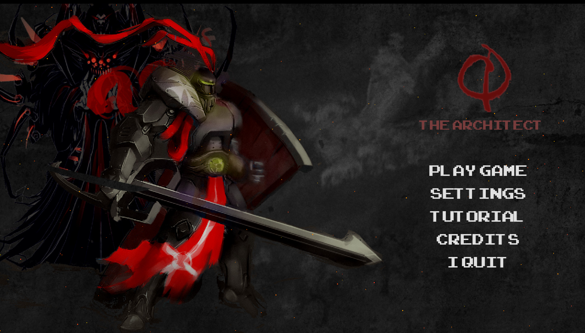
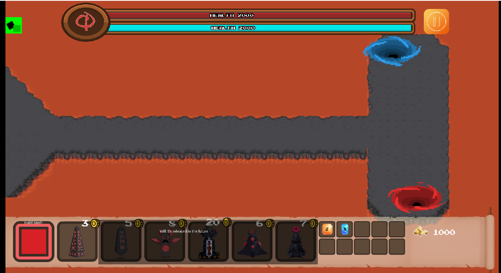
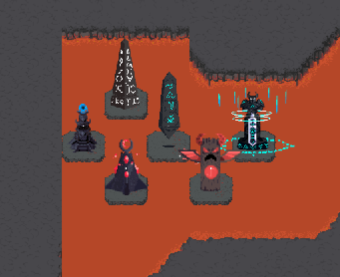
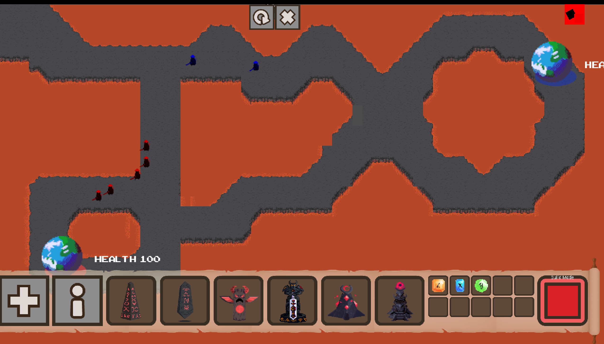
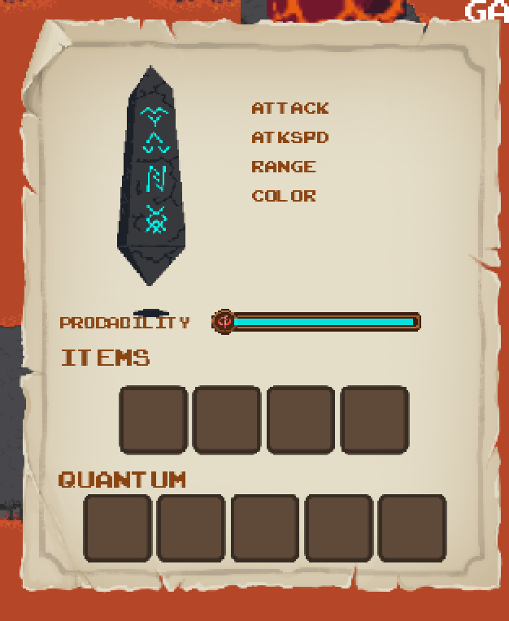

# User Guide

## Installation

1. Navigate to [Quantum-Defence releases](https://github.com/bharathcs/quantum-defence/releases) and download the release for your platform.
1. Unpack it with your inbuilt utilities and run the main app.

- If you encounter any issues regarding 'unidentified developer' or 'unsigned certificate' and you are on a MacOS - follow this [link](https://support.apple.com/en-sg/guide/mac-help/mh40616/mac)

## User Guide

### Menu

- Start a tutorial mode: The tutorial is structured to teach the basics of the game through a series of prompts.
Play the tutorial to familiarise yourself with the UI of the game. 
- Settings: Used to toggle the background music or sfx volume.
- Credits: Credits to everyone involved in the process of making the game.

### Arena Elements

- Enemies: Hostile actors that charge at their base (red / blue) to attack. Red enemies taget the red portal
and vice versa.
- Path: Navigable surface for the enemy. This is usually the stone tiles in the lava maps. 
Towers cannot be built in these paths. This is indicated when trying to build a tower when hovering over a path.
- Base: Red and blue planets (More obvious markers for dimensions tbc) with health bar in the top of the screen.

As shown above, the red bar indicates the health of the red portal and vice versa.
If the portal's start at different health, the health of the portal with higher health will completely fill the bar.
The health of the portal with lower health will be relative to that.

- Enemies instantly recalculate shortest valid path on spawning and on collisions.
- Enemies simulate real mob behaviour by staggering randomly if colliding with fellow enemy
- Special logic to render blue enemies 'invisible' to red enemies and vice versa to prevent collisions across dimensions

- 6 Towers have been made in both blue and red modes each.
- All towers extend from the same class and attacks their enemies
- They have their own instance and set of attributes that can be upgraded with items

### Build

- Select build mode by hitting '+'
- Colour selector allows user to switch between creating red or blue towers
- Click on your chosen tower and then place it on the map. (Using the green / red tile selector as a guide for valid placements)
- Tower is only built on valid tiles, and will begin attacking the available enemies of its colours

### Inspect

- Select inspect mode by hitting 'i'
- Choose towers to see a graphical visualisation of the current attributes of this tower
- At this point, quantum towers can be added in to change the probability of enemy states after hit. (Default is always 100% red or blue to indicate no change to enemy)

**H Gate**

**RY Gate**

**X Gate**

### Tutorial Level (Not ready)

Currently this is very light and not ready at all for milestone 2.

1. Basic game idea (Mostly intuitive)
   - Enemies swarm behaviour, targetting base
   - Bases and Map
   - Aim of protecting bases
1. Tower Defence Mechanisms (With labelled directions)
   - Drop towers
   - Pick up items
   - Upgrade Towers
1. Quantum Items and strategy
   - Directions to try specific upgrades in specific places to try basic strategies
   - Labels and guides to focus on the probability bar
